# AI 기반의 영상 속 음성 및 텍스트를 검색할 수 있는 서비스
 


## :european_castle: 프로젝트 소개

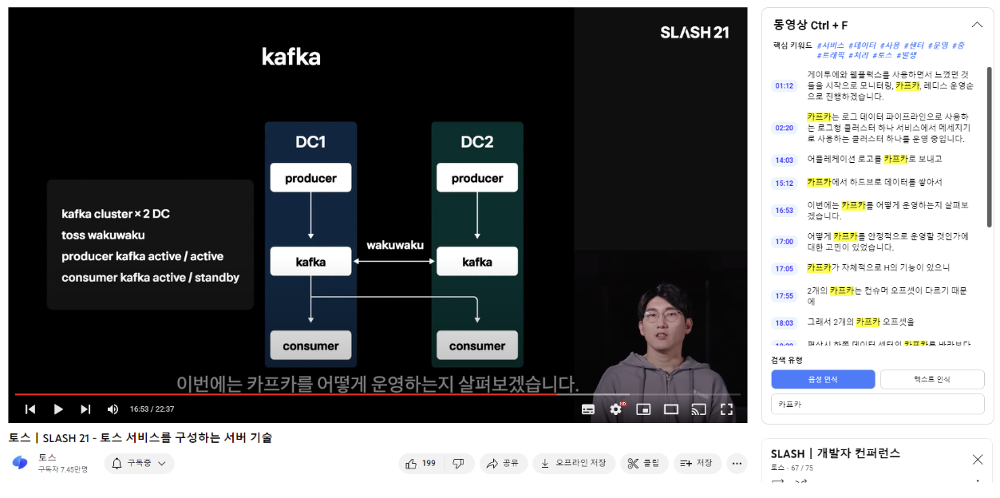

- 프로젝트 명: AI 기반의 영상 속 음성 및 텍스트를 검색할 수 있는 서비스
- 프로젝트 기간: 2023.04.24 ~ 2023.06.13
- 프로젝트 인원: 5명 (AI/Frontend/Backend/Cloud)


|                     [류홍규](https://github.com/HongkyuRyu)                      |                      [박지환](https://github.com/Jihwan98)                      |                      [이형길](https://github.com/Hyunggul)                      |                       [조성록](https://github.com/dev-loggi)                        |                     [최태양](https://github.com/Sunny14578)                      |                               
:---------------------------------------------------------------------------:|:-----------------------------------------------------------------------------:|:-----------------------------------------------------------------------------:|:-----------------------------------------------------------------------------------:|:---------------------------------------------------------------------------: 
|[](https://github.com/HongkyuRyu) | [](https://github.com/Jihwan98) | [](https://github.com/Hyunggul) | [](https://github.com/dev-loggi) | [](https://github.com/Sunny14578)   
|                         **Team Leader**<br>**AI**                     |                        **AI**<br>**Backend**                         |                           **AI / Backend**<br>**Deploy**                       |                                 **Tech Leader**<br>**Frontend**                              |                            **Backend**<br>**Deploy**                           |                              

<br>

KT AIVLE School 대부분 수강생들이 복습을 위해 강의를 재시청할 때 원하는 부분을 빠르게 찾아서 보기 어렵다는 불편함을 크게 겪고 있습니다.

실제로 JTBC 뉴스 보도에 따르면 Z세대는 배속과 건너뜀 기능을 사용하면서 영상을 시청하고 있다는 것을 알 수 있었습니다.

이러닝 수강 시 일반 문서 자료(pdf, ppt, docs 등)와 달리 동영상 자료의 경우 찾기(Ctrl + F) 기능이 없기에 원하는 정보를 찾아보기 위해 

배속과 건너뜀 기능을 사용해야 하는 불편함 존재하여 저희는 영상 속에서 Ctrl+F 기능을 구현하는 서비스를 구현하였습니다.


## 🗂 Repository

<p>
    
    
     <br/>
    
    
    
     <br/>
    
    
    
    
    
</p>


| Team              | Repository                                                                                             |
|-------------------|--------------------------------------------------------------------------------------------------------|
| [Ctrlf Team]()    | [video-ctrlf-introduce](https://github.com/Video-CtrlF/video-ctrlf-introduce)                                                                              |
| [AI Team]()       | [video-ctrlf-ai]()                                                                                     |
| [Frontend Team]() | [video-ctrlf-fe-chrome-extensions](https://github.com/hackathon-AIVLE/video-ctrl-f-chrome-extensions)  |
| [Backend Team]()  | [video-ctrlf-be-web]()                                                                                 |
| [Deploy Team]()   | [video-ctrlf-be-deploy]()                   

<br>

## :earth_asia: 프로젝트 개발내용

### :seedling: 서비스 플로우

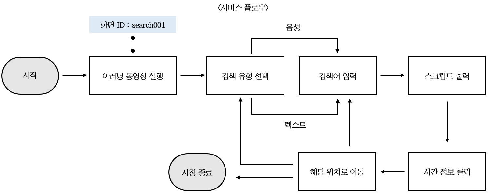

- 사용자(수강생) 화면에서의 서비스 플로우는 위와 같음
- 이러닝 동영상을 실행하면 해당 동영상에 맞는 DB에 접근 후 사용자가 선택한 검색 유형과 검색어에 따라 스크립트를 출력
- 스크립트에서 원하는 문장을 선택할 때 해당 시간 정보에 맞는 화면으로 동영상 위치 이동

<br>

### :herb: UI/UX 개발 내용

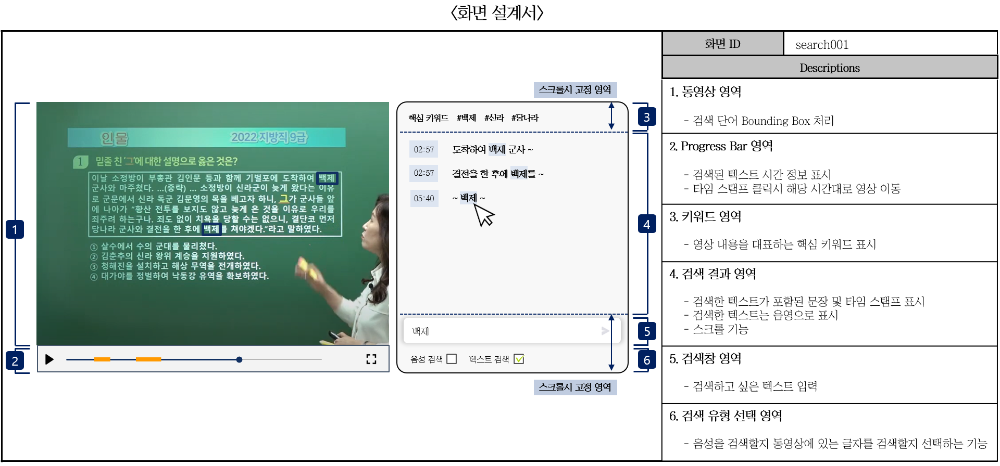

- 동영상 영역에 검색 단어 Bounding Box 처리
- 타임 스탬프 클릭 시 해당 시간대로 이동하는 기능
- 영상 내용을 대표하는 핵심 키워드 표시 기능 
- 검색 결과 영역에 검색한 텍스트가 포함된 문장 및 타임 스탬프 표시
- 음성 검색 혹은 텍스트 검색을 선택하는 기능

<br>

### :blossom: AI 개발내용

[1. Whisper (STT)](https://github.com/openai/whisper)
- 음성 데이터를 텍스트 데이터로 변환하는 STT모델로 Whisper 모델사용

- Whisper는 한국어를 약 8000시간의 데이터로 학습하여, 한국어에서도 뛰어난 성능을 보여줌

- 모델 추론 결과에 발화 시간이 함께 나오기 때문에 시간체크에 유용함

<br>

[2. EasyOCR (OCR)](https://github.com/JaidedAI/EasyOCR)
- 동영상에서 추출한 프레임 내에 나타나는 텍스트를 추출하는 EasyOCR 모델을 사용
- 문자 탐지(Detection) + 인식(Recognition)이 결합된 모델로 한국어에 대한 파인 튜닝이 가능
- 문자 탐지는 Naver Clova AI의 CRAFT를 사용하며, 문자 인식은 VGG-LSTM-CTC 구조를 사용함

<br>

<div align="center" >
  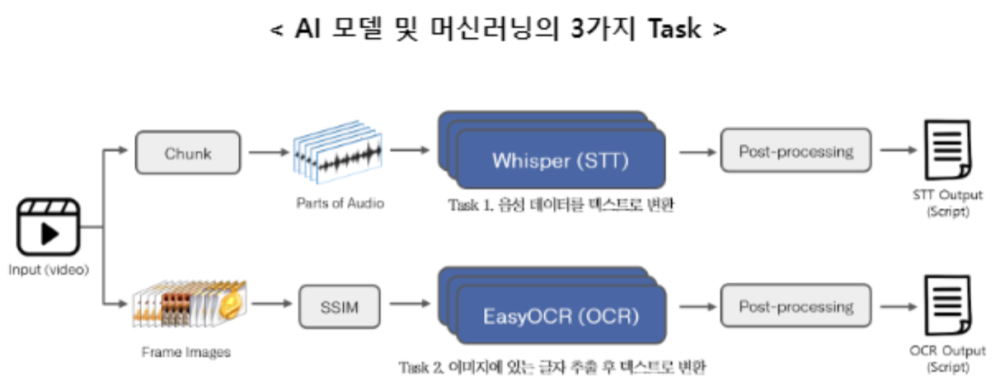
</div>


<br>

<div align="center">
  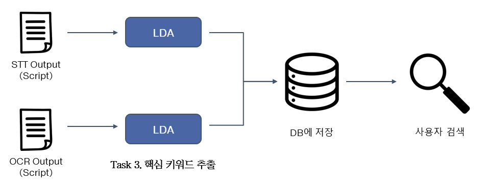
</div>

**Task 1.**  
- 동영상에서 음성 데이터를 발화 단위로 추출하고(Chunk, Parts of Audio) Whisper 모델(STT)을 통해 텍스트와 시간 정보로 변환
- 변환된 텍스트와 시간 정보를 시간 순으로 정렬하여 스크립트 형태로 DB에 저장

**Task 2.**  
- 동영상을 프레임 이미지로 분할한 뒤 EasyOCR 모델을 통해 이미지에 있는 글자를 추출하고 텍스트로 변환 후 시간 정보와 함께 스크립트화
- 이 때, 프레임별 중복 텍스트 방지를 위해 EasyOCR 모델을 수행 전 SSIM을 통해 프레임 수 조절

**Task 3.**  
- <Task 1>과 <Task 2>에서 추출한 텍스트에 LDA 알고리즘을 사용하여 핵심 키워드 20개 추출 후 DB에 저장

<br>

### :deciduous_tree: Web Server 개발 내용
- 동영상 및 스크립트 데이터를 제공하는 REST(Representational State Transfer) API 개발
- 동영상과 AI 모델로부터 생성된 메타데이터를 DB에 저장하는 기능 개발
- AWS Cloud EC2에 EasyOCR, Whisper 모델 서버 구축

<br>

### :hibiscus: AWS ArchiTecture
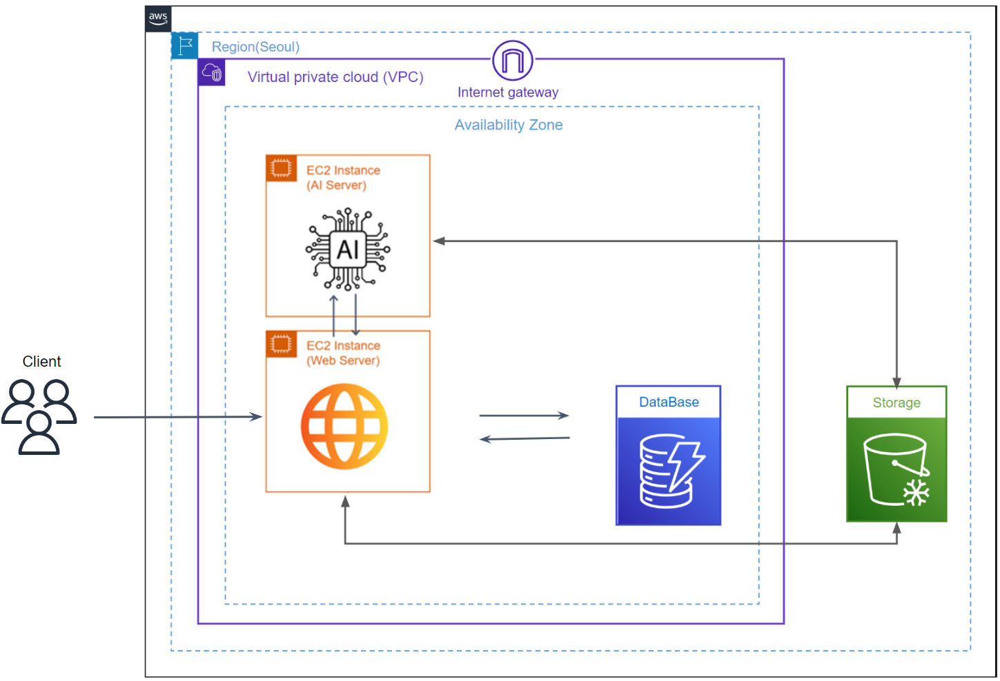

- ‘동영상 Ctrl + F’ 기능을 이용할 동영상을 업로드 후 Storage에 저장
- AI Server로 동영상 전달 후 AI Server에 구축된 AI 모델이 동영상의 메타데이터 생성
- 생성된 메타데이터, 파일 경로, 파일명 DB에 저장
- 동영상 플랫폼에 메타데이터 전송하여 Ctrl + F 기능 표시


<br>

## 🎥 서비스 시연 영상

[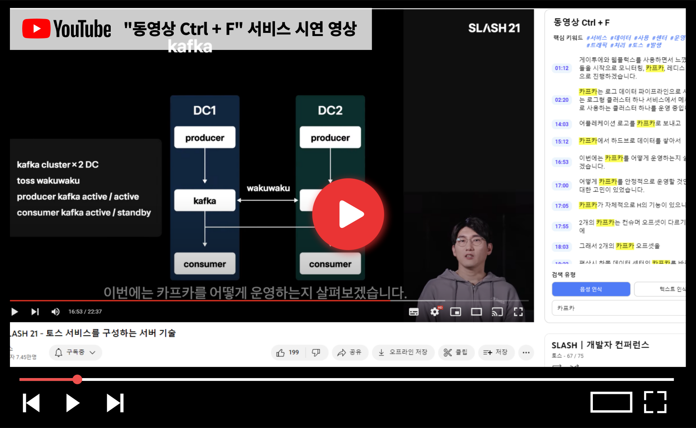](https://youtu.be/UvRD_n5bfaQ)

<p align="center" style="margin: 0">⬆️⬆️ 이미지를 클릭하면 유튜브로 연결됩니다 ⬆️⬆️</p>

<br>

## :milky_way: 팀원 소개

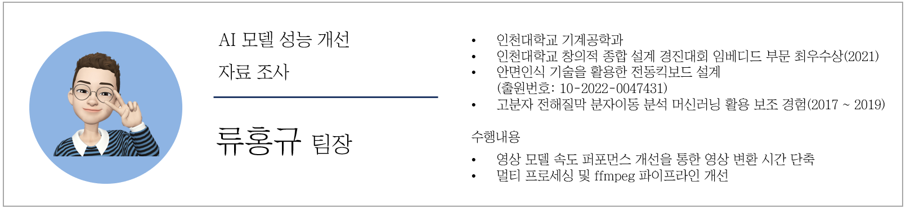
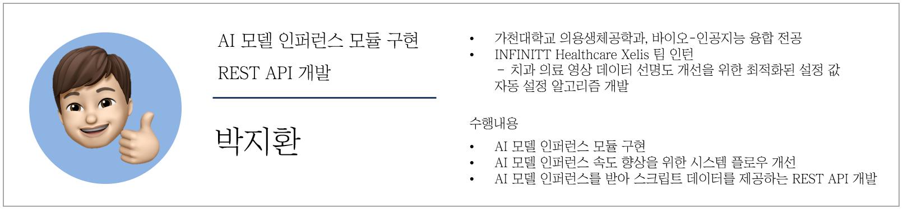
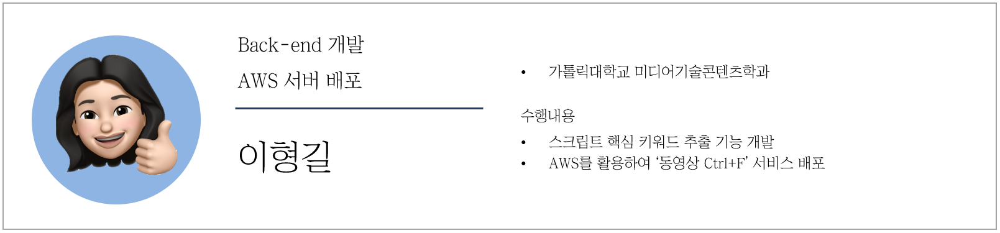
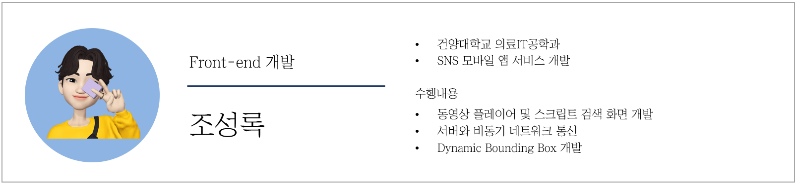
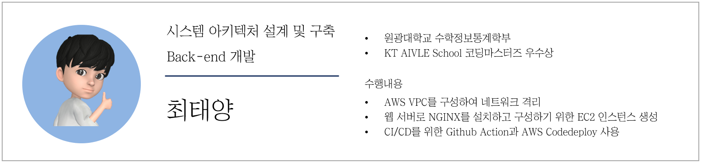

## License
```html
Copyright 2023 kt-aivle-ctrlf

Licensed under the Apache License, Version 2.0 (the "License");
you may not use this file except in compliance with the License.
You may obtain a copy of the License at

http://www.apache.org/licenses/LICENSE-2.0

Unless required by applicable law or agreed to in writing, software
distributed under the License is distributed on an "AS IS" BASIS,
WITHOUT WARRANTIES OR CONDITIONS OF ANY KIND, either express or implied.
See the License for the specific language governing permissions and
limitations under the License.
```