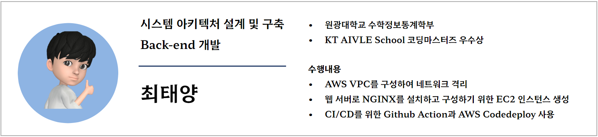

# AI 기반의 영상 속 음성 및 텍스트를 검색할 수 있는 서비스
 

# :evergreen_tree: 팀원 소개

# :european_castle: 프로젝트 소개

- 프로젝트 명: AI 기반의 영상 속 음성 및 텍스트를 검색할 수 있는 서비스
- 프로젝트 기간: 2023.04.24 ~ 2023.06.13
- 프로젝트 인원: 5명 (AI/Frontend/Backend/Cloud)

 

KT AIVLE School 대부분 수강생들이 복습을 위해 강의를 재시청할 때 원하는 부분을 빠르게 찾아서 보기 어렵다는 불편함을 크게 겪고 있습니다.

실제로 JTBC 뉴스 보도에 따르면 Z세대는 배속과 건너뜀 기능을 사용하면서 영상을 시청하고있다는것을 알 수 있었습니다.

이러닝 수강 시 일반 문서 자료(pdf, ppt, docs 등)와 달리 동영상 자료의 경우 찾기(Ctrl + F) 기능이 없기에 원하는 정보를 찾아보기 위해 배속과 건너뜀 기능을 사용해야 하는 불편함 존재하여 

저희는 영상 속에서 Ctrl+F 기능을 구현하는 서비스를 구현하였습니다.

## 🗂 Repository

    
    
      
    
    
    
      
    
    
    
    
    

| Team              | Repository                                                                                             |
|-------------------|--------------------------------------------------------------------------------------------------------|
| [Ctrlf Team]()    | [video-ctrlf-introduce](https://github.com/Video-CtrlF/video-ctrlf-introduce)                                                                              |
| [AI Team]()       | [video-ctrlf-ai]()                                                                                     |
| [Frontend Team]() | [video-ctrlf-fe-chrome-extensions](https://github.com/hackathon-AIVLE/video-ctrl-f-chrome-extensions)  |
| [Backend Team]()  | [video-ctrlf-be-web]()                                                                                 |
| [Deploy Team]()   | [video-ctrlf-be-deploy]()                   

 

# 프로젝트 구조
