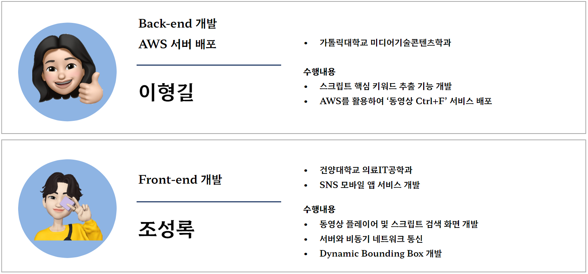

# AI 기반의 영상 속 음성 및 텍스트를 검색할 수 있는 서비스
 

# :european_castle: 프로젝트 소개

- 프로젝트 명: AI 기반의 영상 속 음성 및 텍스트를 검색할 수 있는 서비스
- 프로젝트 기간: 2023.04.24 ~ 2023.06.13
- 프로젝트 인원: 5명 (AI/Frontend/Backend/Cloud)

 

KT AIVLE School 대부분 수강생들이 복습을 위해 강의를 재시청할 때 원하는 부분을 빠르게 찾아서 보기 어렵다는 불편함을 크게 겪고 있습니다.

실제로 JTBC 뉴스 보도에 따르면 Z세대는 배속과 건너뜀 기능을 사용하면서 영상을 시청하고있다는것을 알 수 있었습니다.

이러닝 수강 시 일반 문서 자료(pdf, ppt, docs 등)와 달리 동영상 자료의 경우 찾기(Ctrl + F) 기능이 없기에 원하는 정보를 찾아보기 위해 배속과 건너뜀 기능을 사용해야 하는 불편함 존재하여 

저희는 영상 속에서 Ctrl+F 기능을 구현하는 서비스를 구현하였습니다.

## 🗂 Repository

    
    
      
    
    
    
      
    
    
    
    
    

| Team              | Repository                                                                                             |
|-------------------|--------------------------------------------------------------------------------------------------------|
| [Ctrlf Team]()    | [video-ctrlf-introduce](https://github.com/Video-CtrlF/video-ctrlf-introduce)                                                                              |
| [AI Team]()       | [video-ctrlf-ai]()                                                                                     |
| [Frontend Team]() | [video-ctrlf-fe-chrome-extensions](https://github.com/hackathon-AIVLE/video-ctrl-f-chrome-extensions)  |
| [Backend Team]()  | [video-ctrlf-be-web]()                                                                                 |
| [Deploy Team]()   | [video-ctrlf-be-deploy]()                   

 

# 프로젝트 개발내용

[1. Whisper (STT)](https://github.com/openai/whisper)
- 음성 데이터를 텍스트 데이터로 변환하는 STT모델로 Whisper 모델사용
- Whisper는 한국어를 약 8000시간의 데이터로 학습하여, 한국어에서도 뛰어난 성능을 보여줌
- 모델 추론 결과에 발화 시간이 함께 나오기 때문에 시간체크에 유용함

 

[2. EasyOCR (OCR)](https://github.com/JaidedAI/EasyOCR)
- 동영상에서 추출한 프레임 내에 나타나는 텍스트를 추출하는 EasyOCR 모델을 사용
- 문자 탐지(Detection) + 인식(Recognition)이 결합된 모델로 한국어에 대한 파인 튜닝이 가능
- 문자 탐지는 Naver Clova AI의 CRAFT를 사용하며, 문자 인식은 VGG-LSTM-CTC 구조를 사용함

 

Task 1. 
- 동영상에서 음성 데이터를 발화 단위로 추출하고(Chunk, Parts of Audio) Whisper 모델(STT)을 통해 텍스트와 시간 정보로 변환
- 변환된 텍스트와 시간 정보를 시간 순으로 정렬하여 스크립트 형태로 DB에 저장

Task 2. 
- 동영상을 프레임 이미지로 분할한 뒤 EasyOCR 모델을 통해 이미지에 있는 글자를 추출하고 텍스트로 변환 후 시간 정보와 함께 스크립트화
- 이 때, 프레임별 중복 텍스트 방지를 위해 EasyOCR 모델을 수행 전 SSIM을 통해 프레임 수 조절

Task 3.
- <Task 1>과 <Task 2>에서 추출한 텍스트에 핵심 키워드 추출 알고리즘인 TextRank 알고리즘을 사용하여 핵심 키워드 3개 추출 후 DB에 저장

Task 4.
- <Task 1>과 <Task 2>에서 추출한 텍스트와 사용자가 입력한 검색 키워드의 코사인 유사도를 측정하여 유사도가 가장 높은 단어 3개 추출 후 사용자 화면에 제공

 

 

# :evergreen_tree: 팀원 소개

|                     [류홍규](https://github.com/HongkyuRyu)                      |                      [박지환](https://github.com/Jihwan98)                      |                      [이형길](https://github.com/Hyunggul)                      |                       [조성록](https://github.com/dev-loggi)                        |                     [최태양](https://github.com/Sunny14578)                      |                               
:---------------------------------------------------------------------------:|:-----------------------------------------------------------------------------:|:-----------------------------------------------------------------------------:|:-----------------------------------------------------------------------------------:|:---------------------------------------------------------------------------: 
| |  |  |  |    
|                          **TeamLeader** **AI**                     |                        **AI** **Backend**                         |                           **AI / Backend** **Deploy**                       |                                 **Tech Leader** **Frontend**                              |                            **Backend** **Deploy**                           |                                  